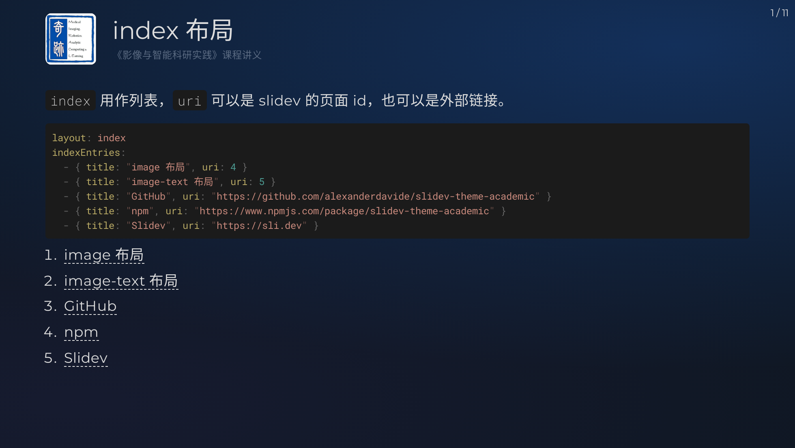
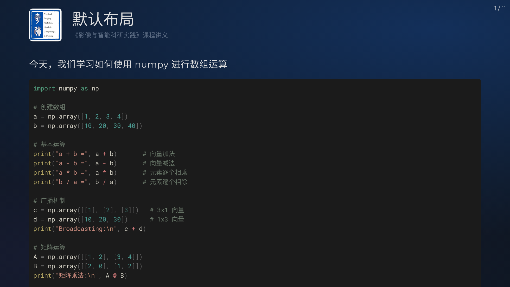

# slidev-theme-miracle

[](https://www.npmjs.com/package/slidev-theme-miracle)  [](https://www.conventionalcommits.org/)


[中文版本](./README.zh.md)

A beautiful theme for lecture, work report and so on. Inspired by Slidev Theme [Academic](https://github.com/alexanderdavide/slidev-theme-academic).


## Install

```bash
npm install -g @iconify-json/mdi
```

Add the following frontmatter to your `slides.md`. Start Slidev then it will prompt you to install the theme automatically.

```
---
theme: miracle
---
```

Learn more about [how to use a theme](https://sli.dev/guide/theme-addon#use-theme).

## Layouts

### cover

```md
---
theme: miracle
layout: cover
class: text-white
logoUrl: https://picx.zhimg.com/80/v2-32c67121f7b3b7395aec3ad20fb97713_1440w.png
topic: 《影像与智能科研实践》课程讲义
coverOrganization: Miracle Lab
coverAuthor: [Kevin Zhou, 锦恢]
coverAuthorUrl: [https://baike.baidu.com/item/%E5%91%A8%E5%B0%91%E5%8D%8E/61922413, https://kirigaya.cn/about]
coverOccasion: 明德楼 C307
coverMedia: https://picx.zhimg.com/80/v2-a9d1b704a4302f984012a03a67ffa61c_1440w.png
---

# 科研实践讲演

## AI Agent 基础技术讲解
```


### table-of-contents

```md
---
layout: table-of-contents
hideInToc: false
---

# 讲演大纲
```


### index

```md
---
layout: index
indexEntries:
  - { title: "image 布局", uri: 4 }
  - { title: "image-text 布局", uri: 5 }
  - { title: "GitHub", uri: "https://github.com/alexanderdavide/slidev-theme-academic" }
  - { title: "npm", uri: "https://www.npmjs.com/package/slidev-theme-academic" }
  - { title: "Slidev", uri: "https://sli.dev" }
---

# index 布局

`index` 用作列表，`uri` 可以是 slidev 的页面 id，也可以是外部链接。
```



### image

```md
---
layout: image
caption: Ender Magnolia Development
footnodeNumber: 1
media: https://pica.zhimg.com/80/v2-9df4eb94bfda11be1874fc6af61087ac_1440w.jpeg
---

# image 布局
```


### image-text

```md
---
layout: image-text
caption: Curated cover image for Slidev
footnodeNumber: 1
media: https://pic1.zhimg.com/80/v2-ca2a555a68993804ed948795aa5ea4f2_1440w.webp
---

# image-text 布局

- 确保图表默认展示美观
- 支持将图表放置在左侧或右侧
- 提供可选的图表标题功能

## frontmatter

```yaml
layout: image-text
caption: Curated cover image for Slidev
footnodeNumber: 1
media: https://pic1.zhimg.com/80/v2-ca2a555a68993804ed948795aa5ea4f2_1440w.webp
\```
```


### default

```md
---
layout: default
---

# 默认布局

今天，我们学习如何使用 numpy 进行数组运算

```python
import numpy as np

# 创建数组
a = np.array([1, 2, 3, 4])
b = np.array([10, 20, 30, 40])

# 基本运算
print("a + b =", a + b)       # 向量加法
print("a - b =", a - b)       # 向量减法
print("a * b =", a * b)       # 元素逐个相乘
print("b / a =", b / a)       # 元素逐个相除

# 广播机制
c = np.array([[1], [2], [3]])   # 3x1 向量
d = np.array([10, 20, 30])      # 1x3 向量
print("Broadcasting:\n", c + d)

# 矩阵运算
A = np.array([[1, 2], [3, 4]])
B = np.array([[2, 0], [1, 2]])
print("矩阵乘法:\n", A @ B)

# 统计运算
print("a 的和 =", a.sum())
print("b 的平均值 =", b.mean())
print("A 的最大值 =", A.max())
\```
```




## Contributing

- `npm run setup`
- `npm run dev` to start theme preview of `example.md`
- Edit the `example.md` and style to see the changes
- `npm run export` to generate the preview PDF
- `npm run screenshot` to generate the preview PNG