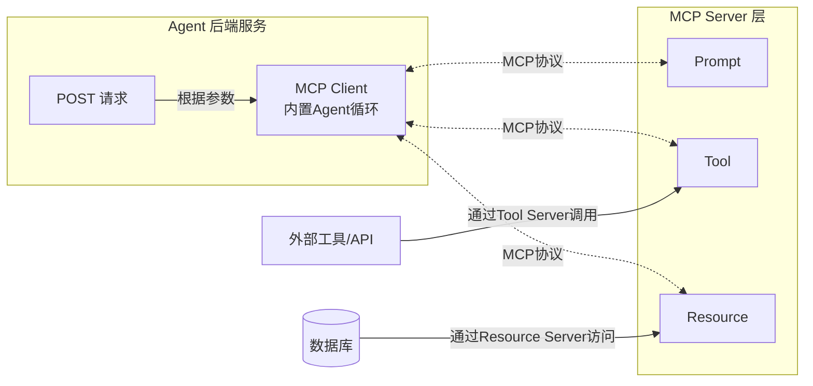

# 科研实践讲演

## AI Agent 基础技术讲解


---
layout: table-of-contents
hideInToc: false
---

# 讲演大纲

---
layout: index
indexEntries:
  - { title: "image 布局", uri: 4 }
  - { title: "image-text 布局", uri: 5 }
  - { title: "GitHub", uri: "https://github.com/alexanderdavide/slidev-theme-academic" }
  - { title: "npm", uri: "https://www.npmjs.com/package/slidev-theme-academic" }
  - { title: "Slidev", uri: "https://sli.dev" }
---

# index 布局

`index` 用作列表，`uri` 可以是 slidev 的页面 id，也可以是外部链接。


```yaml
layout: index
indexEntries:
  - { title: "image 布局", uri: 4 }
  - { title: "image-text 布局", uri: 5 }
  - { title: "GitHub", uri: "https://github.com/alexanderdavide/slidev-theme-academic" }
  - { title: "npm", uri: "https://www.npmjs.com/package/slidev-theme-academic" }
  - { title: "Slidev", uri: "https://sli.dev" }
```

---
layout: image
caption: Ender Magnolia Development
footnodeNumber: 1
media: https://pica.zhimg.com/80/v2-9df4eb94bfda11be1874fc6af61087ac_1440w.jpeg
---

# image 布局

<Footnotes separator>
    <Footnote :number=1>https://www.endermagnolia.com/en/</Footnote>
</Footnotes>

---
layout: image-text
caption: Curated cover image for Slidev
footnodeNumber: 1
media: https://pic1.zhimg.com/80/v2-ca2a555a68993804ed948795aa5ea4f2_1440w.webp
---

# image-text 布局

- 确保图表默认展示美观
- 支持将图表放置在左侧或右侧
- 提供可选的图表标题功能

## frontmatter

```yaml
layout: image-text
caption: Curated cover image for Slidev
footnodeNumber: 1
media: https://pic1.zhimg.com/80/v2-ca2a555a68993804ed948795aa5ea4f2_1440w.webp
```

---

# 默认布局


今天，我们学习如何使用 numpy 进行数组运算

```python
import numpy as np

# 创建数组
a = np.array([1, 2, 3, 4])
b = np.array([10, 20, 30, 40])

# 基本运算
print("a + b =", a + b)       # 向量加法
print("a - b =", a - b)       # 向量减法
print("a * b =", a * b)       # 元素逐个相乘
print("b / a =", b / a)       # 元素逐个相除

# 广播机制
c = np.array([[1], [2], [3]])   # 3x1 向量
d = np.array([10, 20, 30])      # 1x3 向量
print("Broadcasting:\n", c + d)

# 矩阵运算
A = np.array([[1, 2], [3, 4]])
B = np.array([[2, 0], [1, 2]])
print("矩阵乘法:\n", A @ B)

# 统计运算
print("a 的和 =", a.sum())
print("b 的平均值 =", b.mean())
print("A 的最大值 =", A.max())
```

---

# MCP 服务器



---

# Raden 变换

二维逆傅里叶变换给出 $f(x,y)$：

$f(x,y) = \iint_{-\infty}^{\infty} F(k_x,k_y)\, e^{j2\pi (k_x x + k_y y)}\, dk_x\,dk_y.$

换成极坐标 $(k_x,k_y) = (\omega\cos\theta, \omega\sin\theta)$，有 $dk_x\,dk_y = |\omega|\,d\omega\,d\theta$。于是

$\begin{aligned} f(x,y) &= \int_{0}^{\pi}\int_{-\infty}^{\infty} F(\omega\cos\theta,\omega\sin\theta)\, e^{j2\pi \omega (x\cos\theta + y\sin\theta)}\,|\omega|\,d\omega\,d\theta \\ &= \int_{0}^{\pi}\int_{-\infty}^{\infty} P_\theta(\omega)\, |\omega|\, e^{j2\pi \omega (x\cos\theta + y\sin\theta)}\, d\omega\, d\theta, \end{aligned}$

其中我们用到了投影-切片定理将 $F$ 换成 $P_\theta$。

---
layout: center
class: "text-center"
---

# Footnotes & Footnote

<span class="font-extralight">
  <q>Give credit where credit is due</q>
  <sup>1</sup>
</span>

<Footnotes separator>
  <Footnote :number=1>Smart person</Footnote>
</Footnotes>

---
layout: center
class: "text-center"
---

# Pagination

<span class="font-extralight">Enabled by default</span>


<p class="absolute font-extralight right-14 transform rotate-8 top-4">Here!</p>

